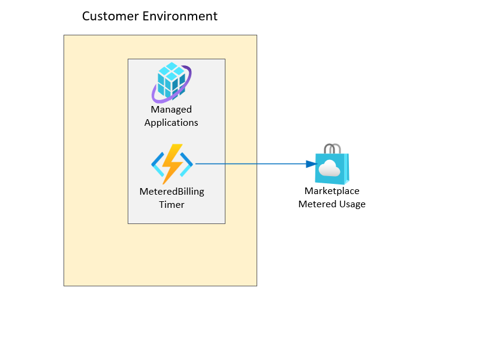

# Deploy  Azure Marketplace Managed-App with built-in Custom billing Meter:

This demo shows how to deploy Managed App with Function app to  emit meter usage events to marketplace using predefined dimensions and quantities based on config.

## Design
The following diagrm shows the overall workflow for this demo

## Custom billing Senario

This demo shows how to implement a recurring custom Free billing that happening once the managed resources are created using Azure function timer crobjob.

## Important Configuration
ARM template expects the following configuration

1. <b>_artifactsLocation</b> ARM template will deploy function from a Zip file so it is expected to pass the location of the zip file using this `_artifactsLocation` parameter

1. <b>_artifactsLocationSasToken</b> It is optional and only required if accessing the function zip file require a token

1. <b>DIMENSION_CONFIG</b> predefined dimensions and quantities that the function will use to emit usage event to Azure marketplace

1. ARM using resource type `Microsoft.Resources/deployments` 

In order to pass the Partner center validation you need to update the resource name with the Custerom PID Guid from PartnerCenter

1. ARM Template will deploy function using `WEBSITE_RUN_FROM_PACKAGE` and expecting `functionpackage.zip` to place under `artifacts` folder.

