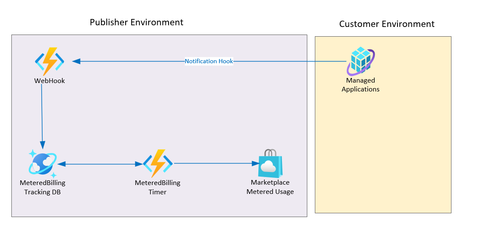
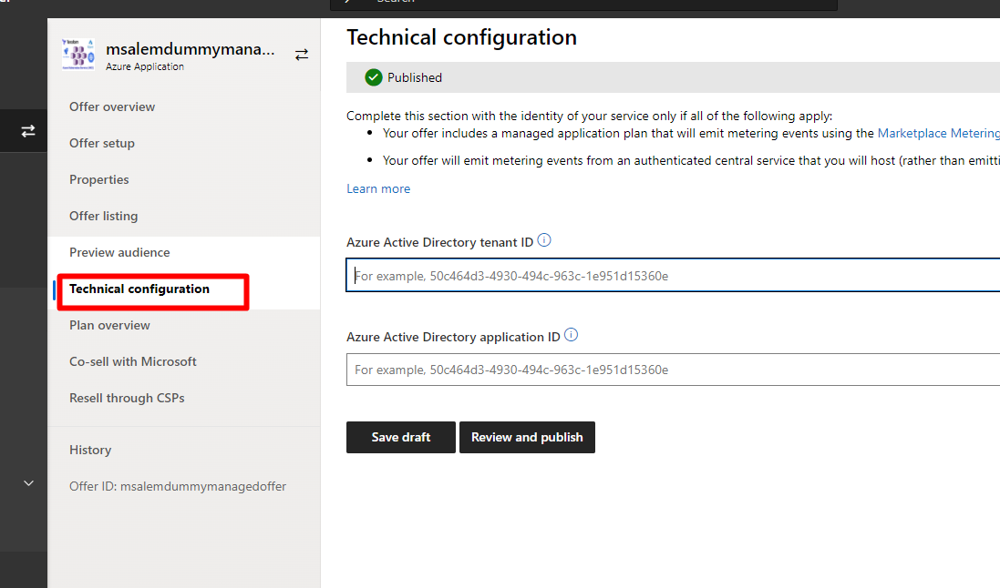
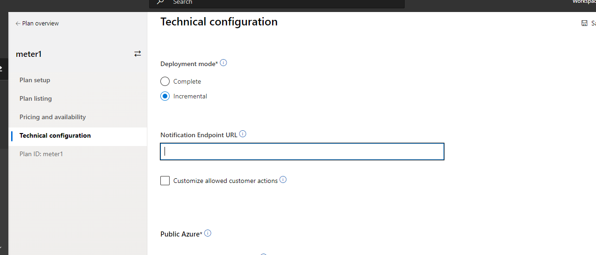

# Deploy Metered Listenner App for Azure Marketplace Managed-App:

This demo shows how to deploy azure function to monitor managed app notification and emit meter usage events to marketplace using predefined dimensions and quantities based on config.

## Design
The following diagrm shows the overall workflow for this demo

## Custom billing Senarios

The source code show two different senario for custom billing.

1. One Time Fee custom billing that happening once the managed resources are created. Please refer to [custom-billing folder](./custom-billing)

1. Recurring custom Free billing that happening once the managed resources are created. Please refer to [recurring-custom-billing folder](./recurring-custom-billing)

## Important Configuration
ARM template expects the following configuration
1. <b>tokenResource</b> This value should be set to `20e940b3-4c77-4b0b-9a53-9e16a1b010a7` [refer to the Marketplace Authentication doc](https://docs.microsoft.com/en-us/azure/marketplace/marketplace-metering-service-authentication)

1. <b>_artifactsLocation</b> ARM template will deploy function from a Zip file so it is expected to pass the location of the zip file using this `_artifactsLocation` parameter

1. <b>_artifactsLocationSasToken</b> It is optional and only required if accessing the function zip file require a token

1. <b>DIMENSION_CONFIG</b> predefined dimensions and quantities that the function will use to emit usage event to Azure marketplace

## Managed App Technical Configuration

Use the Arm Template output result to configure managed app as following

Under Techical Configuration

1. <b>tenantId</b> => "Azure Active Directory tenant ID"

1. <b>identityApplicationId</b>=> "Azure Active Directory application ID"

Under plan technical configuration :

1. <b>webhookEndpoint</b> => "Notification Endpoint URL"

