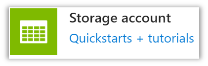

# Lab 1: Your first Azure Managed Application
Azure Managed Applications Workshop

## Lab Overview

In this lab you will deploy an Azure Managed Application, then customize that application and re-deploy it.

## Prerequisites

### Azure portal

You must have an Azure account and an active Azure subscription to complete this lab. 
If you do not have an Azure subscription, you can create a free one [here](https://azure.microsoft.com/). You will need a credit card, but can cancel before any billing takes place.

### Visual Studio Code and ARM extension

1.	If you don’t have it installed, download the Visual Studio Code editor.

    [Download Visual Studio Code - Mac, Linux, Windows](https://code.visualstudio.com/Download)

2.	Once you have Visual Studio Code installed, install the ARM Template extension from Microsoft.

    [Azure Resource Manager (ARM) Tools](https://marketplace.visualstudio.com/items?itemName=msazurermtools.azurerm-vscode-tools)

# Exercise 1: Deploy an Azure Managed Application with Service Catalog

## Overview

In this exercise, you will deploy a Managed Application in the Azure portal. You’ll do this using an Azure service called the “Service Catalog.”

## Clone the workshop repository

1.	Clone this repository to your local machine.

    [A workshop for Azure Managed Applications](https://github.com/dstarr/ama-workshop)

## Create the Azure Managed Application package

1.	Create a ZIP file that contains these 2 files at the root of the ZIP.

- ama-workshop / lab-1 / begin / createUiDefinition.json
- ama-workshop / lab-1 / begin / mainTemplate.json

2.	Name your ZIP file `app.zip`.

    **Note:** If you are using a Mac, it is important you don’t pick up any hidden files from your file system.

## Create a new storage account and container

1.	Browse to the [Azure portal](https://portal.azure.com) and log in.
2.	Create a new Resource Group. We will call the one in this lab “MA-rg.”
3.	Within the MA-rg resource group, create a storage account. 

    

4.	While going through the setup steps, use the following values.
    - Storage account name > Some unique value
    - Basics > Replication > Locally Redundant Storage (LRS)
    - Networking > Network Connectivity > Public endpoint (all networks)
    - Data Protection > Leave defaults
    - Advanced > Leave defaults
    - Tags > Leave defaults

5. Create a new container in blob storage.

    
 
    Use the following values when creating the container.

        - Name: arm-templates
        - Public access level: Blob

    
 
## Upload app.zip

1.	Click into the new container.
2.	Select “Upload.”
3.	Browse to app.zip and upload the file.
4.	Right click the new blob and select > Properties.
5.	Copy the URL to your clipboard and paste it somewhere you can get back to it later.

    
 
## Create a Service Catalog managed application definition

1.	In your resource group, add a **Service Catalog Managed Application Definition**.

    

2.	On the creation form, use the following values.
    - Name: ma-01
    - Display name: ma-01
    - Package file uri: The URI you copied in the previous step
    - Deployment Mode: Complete
    - Lock level: None
3. Select the Create button

## Install the application 

1.	From within your resource group, click the Service catalog managed application definition you just created.
2.	Select **Deploy from definition**.
3.	Go through the setup screens and create the managed application.

## Remote desktop into the machine

1.	Once the deployment is complete, open the Remote Desktop application. 

    **Note:** You can install from the App Store if you are on a Mac. Install from the Microsoft store if you are on Windows.

2.	Go to the VM you created in the Azure portal.
3.	Copy its IP address and use it with Remote Desktop to remote into the machine.
Use the credentials you specified during installation to log in.
4.	Once logged in, just shut down the machine so you won’t be charged for VM uptime.

# Exercise 2: Modify the application

## Overview

In this exercise, you will change the type of VM from Windows 10 to Ubuntu and, add a storage account to your application, and redeploy the application.

## Modify the ARM template

1.	Open the ARM template (mainTemplate.json) for editing.
2.	In the parameters section add the following 2 parameters. This will be populated by outputs of the `createUiDefinition.json`, which you will modify later.

```json
    "storageAccountPrefix": {
        "type": "string",
        "metadata": {
            "description": "Assign a prefix for the Storage account"
        }
    },
    "storageAccountType": {
        "type": "string",
        "metadata": {
            "description": "Assign Storage account type"
        }
    }
```

3.	In the variables section, change the `osType` variable to create an Ubuntu image instead of Windows. To do so, make the osType variable JSON look like the following.

```json
    "osType": {
        "imageOffer": "UbuntuServer",
        "imageSku": "18.04-LTS",
        "imagePublisher": "Canonical"
    }
```

4.	In the variables section, add the following line.

```json
    "storageName": "[concat(parameters('storageAccountPrefix'), uniqueString(resourceGroup().id))]"
```

5.	Insert the below JSON as the last resource to be created in the ARM template. This JSON specifies that the ARM template will create a plain storage account.

```json
    {
        "type": "Microsoft.Storage/storageAccounts",
        "name": "[variables('storageName')]",
        "apiVersion": "2019-06-01",
        "location": "[parameters('location')]",
        "sku": {
            "name": "[parameters('storageAccountType')]"
        },
        "kind": "Storage",
        "properties": {
            "allowBlobPublicAccess": true
        }
    }
```

## Modify createUIDefinition.json

Here you will update the `createUiDefinition.json` file to create an installation experience that prompts the user for details needed to create an Azure Storage account. The values gathered will be input into the ARM template as parameters at install time.

> __Note:__ At any point in editing the `createUiDefinition.json` file, consider using the [Create UI Definition](https://portal.azure.com/?feature.customPortal=false#blade/Microsoft_Azure_CreateUIDef/SandboxBlade) sandbox in the Azure portal to check your sytax and functionality.

1.	Open the UI Definition file (createUiDefinition.json) for editing.
2.	Add the following JSON as the last member of the steps array.

```json
    {
        "name": "storageBlade",
        "label": "Storage",
        "bladeTitle": "Storage settings",
        "elements": [
            {
                "name": "storageAccount",
                "type": "Microsoft.Storage.MultiStorageAccountCombo",
                "label": {
                    "prefix": "Storage account name prefix",
                    "type": "Storage account type"
                },
                "defaultValue": {
                    "type": "Premium_LRS"
                },
                "toolTip": {
                    "prefix": "Storage account name prefix",
                    "type": "Storage account type"
                },
                "count": 2,
                "visible": true
            }
        ]
    }

```

3.	Add the following 2 lines to the end of the outputs section. These are the parameter names you included in the ARM template earlier.

```json
"storageAccountPrefix": "[steps('storageBlade').storageAccount.prefix]",
"storageAccountType": "[steps('storageBlade').storageAccount.type]"
```

## Use the ARM template test toolkit (optional)

**Perform this step if you aren't running low on time.**

In this section, you will download a tool used in testing ARM templates and use it to test your mainTemplate.json and createUiDefinition.json files.

1.	Follow the instructions in the linked article below, using `../ama-workshop/Lab 1/begin` as the target folder.

    [ARM template test toolkit - Azure Resource Manager](https://docs.microsoft.com/en-us/azure/azure-resource-manager/templates/test-toolkit)

2.	Fix any errors reported by the tool.

# Exercise 3: Publish the new application

In this last exercise, you will package your new application and publish it. After that, you’ll check to see that the VM you deployed is up and running.

## Create the AMA package

1.	Delete the old app.zip file
2.	ZIP the 2 files into a new file named app.zip
3.	Delete the old app.zip from blob storage and upload the new one

## Create a Service Catalog offer

Create a new Service Catalog Managed Application definition, just as you did before. Use a new different for this definition.

## Install the application

Install the app just as you did before, this time using a different name for the application.

## Check that the machine is running

After the installation completes, the VM you created will be left in a running state. 

Since it is an Ubuntu server, you would need to SSH into the box to manage it. You are free to SSH into the machine if you know how, but you can also just see in the menu bar on the VM’s portal page that it is running.

**Shutdown the machine**.

# Lab Summary
Congratulations, you now know how to create a simple managed application and publish it through a Service Catalog within the Azure portal. 

In this lab you created an Azure Managed Application and published it to a Service Catalog. From there, you installed the application. You also enhanced the application’s ARM template and installation interface.

## Additional Resources

1.	[Azure Managed Applications documentation](https://docs.microsoft.com/en-us/azure/azure-resource-manager/managed-applications/)
2.	[Publish service catalog managed app - Azure Managed Applications](https://docs.microsoft.com/en-us/azure/azure-resource-manager/managed-applications/publish-service-catalog-app?tabs=azure-powershell)
3.	[Use Azure portal to deploy service catalog app - Azure Managed Applications](https://docs.microsoft.com/en-us/azure/azure-resource-manager/managed-applications/deploy-service-catalog-quickstart)

