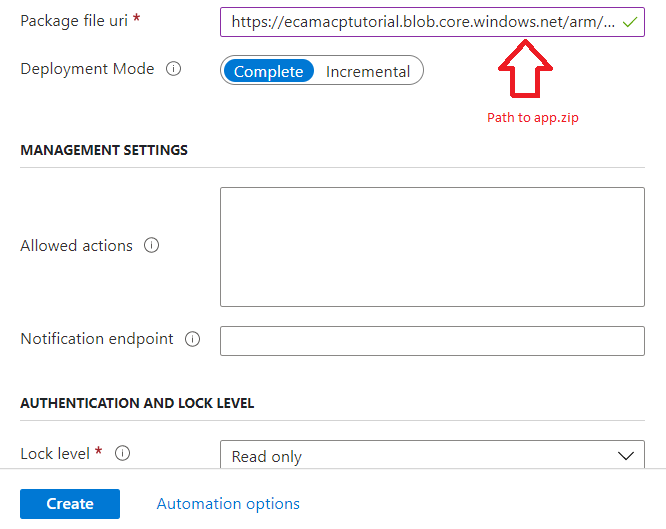
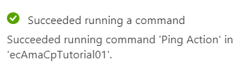
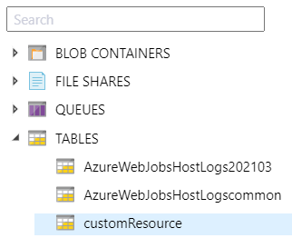

# Lab 4: Implementing custom providers

Azure Managed Applications Workshop

## Lab overview

In this lab you will customize and deploy a managed application with functionality to manage and store custom resources.

# Exercise 1: Deploy the function package

In this exercise you will deploy a packaged Azure function to a storage account, making it ready for deployment by an ARM template.

## Create a storage account

1. Create a new Azure storage account
2. Put it in a new resource group named "AMALab5"

## Upoad the function application

Use the Azure portal for the following steps.

1. In the blob storage of your new storage account, create a container named "function".

    **Note:** The _Public access level_ for the new container should be set to "Blob". This allows the blob to be read anonomously if you have the URL.

2. Upload the `lab-5/begin/functionpackage.zip` file to the new container.
3. Click on the ZIP file and then copy the URL for that blob.
4. Paste the URL to a location for use later. You will need this URL when deploying the final application.

# Exercise 2: Set up the ARM template

In this exercise you will add the custom provider resources to the `mainTemplate.json` ARM template for a managed application. 

## Add the custom provider resource

1. Find the resources section and note there are already 3 resources defined.
2. Add the following JSON to the array of resources so the ARM template will create the custom resource provider.

```json
{
    "apiVersion": "[variables('customrpApiversion')]",
    "type": "Microsoft.CustomProviders/resourceProviders",
    "name": "[variables('customProviderName')]",
    "location": "[parameters('location')]",
    "properties": {
        "actions": [],
        "resourceTypes": []
    },
    "dependsOn": [
        "[concat('Microsoft.Web/sites/',parameters('funcname'))]"
    ]
}

```

## Add custom actions

1. Add the following actions to the `actions` array.

```json
{
    "name": "ping",
    "routingType": "Proxy",
    "endpoint": "[listSecrets(resourceId('Microsoft.Web/sites/functions', parameters('funcname'), 'HttpTrigger1'), '2018-02-01').trigger_url]"
},
{
    "name": "autos/contextAction",
    "routingType": "Proxy",
    "endpoint": "[listSecrets(resourceId('Microsoft.Web/sites/functions', parameters('funcname'), 'HttpTrigger1'), '2018-02-01').trigger_url]"
}
```

## Add the custom resource type

1. Find the `resourceTypes` array.
2. Add the following resource type to the array.

```json
{
    "name": "autos",
    "routingType": "Proxy,Cache",
    "endpoint": "[listSecrets(resourceId('Microsoft.Web/sites/functions', parameters('funcname'), 'HttpTrigger1'), '2018-02-01').trigger_url]"
}
```

# Exercise 3: Set up the view definition

In this exercise you will add the custom provider elements to the `viewDefinition.json` that defines the interface for the managed application. You will add UI elements that make use of the function application for customizing the managed application.

## Add the overview command

1. Open the `lab-5/begin/viewDefinition.json` file for editing.
2. Find the **overview** section and add the following JSON after the **description** to declare a command. This command will appear at the top of the managed application.

```json
"commands": [
    {
        "displayName": "Ping Action",
        "path": "/customping",
        "icon": "LaunchCurrent"
    }
]
```
The **overview** view should now look like this.

```json
{
    "kind": "Overview",
    "properties": {
        "header": "Welcome to ...",
        "description": "This Managed application ...",
        "commands": [
            {
                "displayName": "Ping Action",
                "path": "/customping",
                "icon": "LaunchCurrent"
            }
        ]
    }
}
```

## Add commands

1. Find the `"resourceType": "autos"` value.
2. Below that, add the following JSON to define the command that will be executed.

```json
"commands": [
    {
        "displayName": "Custom Context Action",
        "path": "autos/contextAction",
        "icon": "Start"
    }
]
```
## Add columns for layout

Under the new `commands` array, add the following JSON to define the layout for showing any custom resources.

```json
"columns": [
    {
        "key": "properties.Make",
        "displayName": "Make"
    },
    {
        "key": "properties.Model",
        "displayName": "Model",
        "optional": true
    }
]
```

## Add the custom resources UI

Under the new `columns` array, add the following `createUIDefinition` section.

```json
"createUIDefinition": {
    "parameters": {
        "steps": [
            {
                "name": "add",
                "label": "Add Automobile",
                "elements": [
                    {
                        "name": "make",
                        "label": "Make",
                        "type": "Microsoft.Common.TextBox",
                        "defaultValue": "",
                        "toolTip": "Provide a make for this auto.",
                        "constraints": {
                            "required": true
                        }
                    },
                    {
                        "name": "model",
                        "label": "Model",
                        "type": "Microsoft.Common.TextBox",
                        "defaultValue": "",
                        "toolTip": "Provide a model name for this auto.",
                        "constraints": {
                            "required": true
                        }
                    }
                ]
            }
        ],
        "outputs": {
            "name": "[steps('add').name]",
            "properties": {
                "Make": "[steps('add').make]",
                "Model": "[steps('add').model]"
            }
        }
    }
}
```
Note the above is a fully formed createUIDefinition as you might find in a dedicated file of the same name.


You now have a fully formed `viewDefinition.json`.    

The work you have just done looks like the following JSON (details ommitted for clarity).

```json
"properties": {
    "displayName": "Autos",
    "version": "1.0.0.0",
    "resourceType": "autos",
    "createUIDefinition": {...},
    "commands": [...],
    "columns": [...]
}
```

# Exercise 4: Deploy the managed application package

In this exercise you will add the managed application artifacts to a storage account, making them ready for deployment.

## Create the deployment package

ZIP the following files into a ZIP file with the files at the root.

- createUiDefinition.json
- mainTemplate.json
- viewDefinition.json

## Upload the package to the storage account

1. In the storage account you created earlier, create a new container named "arm".

    **Note:** The _Public access level_ for the new container should be set to "Blob". This allows the blob to be read anonomously if you have the URL.

2. Upload your ZIP file into this container.
3. Copy the URL for this blob and paste it somewhere so you have easy access to it later.

# Exercise 5: Deploy the managed application

In this exercise you will create a new Managed Application Definition and use it to deploy the managed application.

## Create the managed application definition

1. Create a new "Service catalog managed application definition" in the Azure portal.
2. Fill it out as shown below.




## Deploy the managed application

After creating the AMA Definition, deploy it as a managed application.

**Note:** You will need the URL of the function's ZIP file that you noted at the beginning of this lab.

# Exercise 6: Using custom resources

In this exercise you will use the custom provider functionality you added to the managed appliciation.

## Running the ping action

1. Navigate to the newly created managed application.
2. At the top of the page, find the button labeled "Ping Action."

This button was defined in the Overview section of `viewDefinition.json` as a command.

3. Click the button to send a ping to the function application that was deployed. A successful return looks like the following.



## Managing autos

1. In the left hand menu of the managed application, find the menu item labeled "Autos" under the "Resources" section.
2. Click the "Autos" button. You are directed to a screen showing a list of automobile names. The list is currently empty.

> This screen layout was defined by the `columns` section of `viewDefinition.json`.

### Add new autos

When creating a new auto, you are actually creating a new Azure resource.

1. Click Add

> This screen was defined by the `createUIDefinition`  section of `viewDefinition.json`.

2. Enter a new auto's make (manufacturer) and model.
3. Review the new resource to ensure it passes validation. and submit the new resource.

> You can now see the new Azure resource in the list of autos.

4. Add another auto.

### Inspecting the auto resource id

1. Click on one of the autos in the list.

> This resource overview shows the containing resource group and subscription like any other resource in Azure.

2. Click the "Properties" menu item on the left.
3. Scroll down to inspect the "Resource ID" property.

> This resource ID demostrates this resource is addressable via Azure APIs like any other resource in Azure.

### Inspecting auto storage

Now that we've seen this is an Azure resource, let's look at where it is stored.

1. Navigate to the resource's managed resource group.
2. Open the storage account that was created in the resource group.
3. From the left hand menu, open the "Storage Exlporer" menu item.
4. Expand TABLES as shown below.



5. Click on the customResource table.
6. Inspect the custom resources that were created by the resource provider.
7. Scrolling to the right shows the DATA column, which contains the JSON representation of each resource you created.

### Deleting an auto

1. Navigate back to the managed application you created.
2. Click the "Autos" menu item on the left.
3. Click on a auto resource.
4. On the resource's Overview page, click the Delete button and confirm deletion.

You now only see one auto resource.

You may go back to the storage table to see the record for that rescource no longer exists.

# Congratulations

In this lab you used custom resource providers defined in ARM templates to create custom resources.