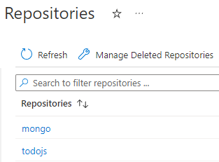
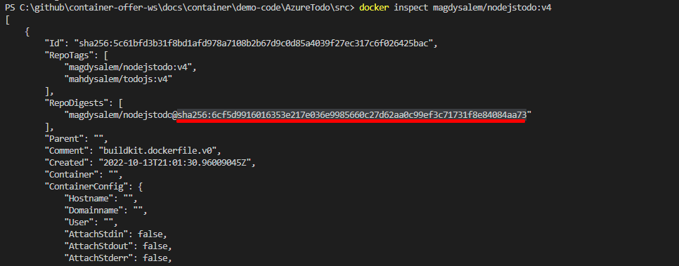

---
# Page settings
layout: default
keywords: Azure Marketplace Container Offer Mastering the Marketplace
comments: false

# Micro navigation
micro_nav: false

title: Lab 1

hide:
- navigation
---

[Home](../../../) > [Container Offers](../../) > [Labs](../../index.md#labs) 🧪

# Lab 1 - Prepare for Container Deployment

> **Note:** This lab is part of a series of labs for Mastering Container Offers Workshop. You must finish this lab before moving on to the next sections.

This lab will take you from start to finish in getting your artifacts ready for publication of your Container Offer. You'll start by getting containers running locally and move to updating deployment files in preparation for publishing the entire solution to your ACR.

<!-- no toc -->
- [Getting started](#getting-started)
- [Prepare Solution Images](#prepare-solution-images)
- [Run Containers Locally](#run-containers-locally)
- [Push Images to ACR](#push-images-to-acr)
- [Helm Chart](#helm-chart)
- [Update Deployments File](#update-deployments-file)
- [Update the UI Definition File](#update-the-ui-definition-file)
- [Update the ARM Template](#update-the-arm-template)
- [Update Package Manifest File](#update-manifest-file)

---

## Getting started

> ⚠️ You must have completed all [prerequisites](../prerequisites/index.md) before continuing with this lab.

### Azure Container Registry (ACR)

If **Admin user** is not enabled on your ACR, select **Settings > Access** keys in the left menu and enable it in the Azure portal as shown in the following image.

Capture the following values as you will need them throughout the remainder of the labs.
  
- Login server
- Username
- Password

### ❗Your working folder

This section is extrememly important for working easily through the labs.

You will be working with one solution throughout all the labs. To make it easier to work with the solution, you will make a copy of the solution folder and move it to a location of your choice outside the Git repository folder that holds these labs.

1. Copy the folder `<path to Git repo>/docs/container/lab1-prepare-container-deployment/begin`.
2. Copy this folder to a location of your choice. `c:\projects\begin` for example.
3. Rename the `begin` folder to `container-labs`.
4. From now on, the labs will refer to `container-labs` when referring to your working folder.

## Prepare Solution Images

In this section, you will create a `DockerFile` for solution `Azure ToDo` and publish the image to your ACR created in [the prerequisites exercise](../prerequisites/index.md). The sample solution is a simple to-do application that is already completed for you. The intent of this lab is not to have you write code, but to prepare your container offer artifacts.

1. Using your text editor, open the following Dockerfile.

        container-labs/code/Dockerfile

2. Add the following code to the Dockerfile taking care not to delete the first line.

        # Create app directory
        WORKDIR /usr/src/app
        RUN apk update
        # Copy solution package file
        COPY package*.json ./

        # Install app dependencies
        RUN npm install
        RUN npm audit fix --force
        # Copy all files
        COPY . .

        # Add command to expose web app port 
        EXPOSE 3000

        # Command to start the application
        CMD [ "npm", "start" ]

3. Ensure Docker Desktop is running. 
4. Run the following commands to build the image.

        cd `container-labs\code`
        docker build -t <ACR Login Server Name>/todojs:v1 .

5. The solution uses MongoDB for storage. You're going to run MongoDB in another container.

    Run the following commands to pull mongodb image locally and tag it.

        docker pull mongo:latest 
        docker tag mongo:latest <ACR Server name>/mongo:latest

6. If you enter the following command, you should see the two local images prefixed with your ACR name.

        docker images

## Run Containers Locally

In this section we will run the solution locally with Docker.

1. Create a user-defined bridge network.

        docker network create todo-net

1. Start by running MongoDB locally. Specify an `admin username` and `password` of your choice for the mongoDB instance.

        docker run -d --net todo-net -e MONGO_INITDB_ROOT_USERNAME:<admin username> -e MONGO_INITDB_ROOT_PASSWORD:<password> -p 27017:27017 --name mongotodo  mongo:latest

1. Start the main AzureTodo web application container.

        docker run -d --net todo-net -p 3000:3000 -e ENVIRONMENT:development -e DATABASE_NAME:azure-todo-app -e DATABASE_URL=mongodb://mongotodo:27017 <ACR Login Server Name>/todojs:v1 

1. Verify the containers are running correctly. Run the following command to see the two containers.

        docker ps

1. Browse the web application by going to <a href="http://localhost:3000" target="_blank">http://localhost:3000</a>

1. Try to create and delete tasks to make sure site is running properly

## Push Images to ACR

In this section we will publish or **push** the solution images to the ACR you created in prerequisites.

1. Open a terminal window (WSL2 on Windows) and run the following commands to login into ACR server. 

        docker login <ACR Login Server Name> -u <ACR admin> -p <ACR password>

2. Push the `todo.js` image to your ACR.

        docker push <ACR Server name>/todojs:v1

3. Push the mongo image to your ACR.

        docker push <ACR Server name>/mongo:latest

    You can now see the images in your ACR.

4. Open the [Azure portal](https://portal.azure.com) and browse to your ACR.
5. In the left menu, select **Services > Repositories**.
6. You should see an a view like the following image.

    

## Helm Chart

In this section will explore the Helm Chart directory `AzureTodo`.

> **About Helm**
>
> Helm is the package manager for Kubernetes. In other words, it is used to help you manage Kubernetes applications. Helm is the Kubernetes equivalent of `yum` or `apt`. Helm deploys charts, which you can think of as a packaged application.

1. Open  `container-labs\container-package\AzureTodo\values.yaml` in your text editor.
2. Update lines 10 & 14 with your ACR server name. For example `myacr.azureacr.io`.
3. Locate the value of the `todojs:v1` digest and copy it.

    > **Image Digest**
    >
    > The image digest is the hash of the image index or image manifest JSON document.

    Inspect the images you pushed to the ACR earlier. Open each repository in the ACR and see that individual versions of an image will have their own **Digest** value.

    > **Get Digest from local image**
    >
    > Run `docker inspect <myacr>.azureacr.io\todojs:v1` you can locate the disget value under **RepoDigests**

    >

4. Paste the `todojs:v1` digest value onto line 8.
5. Update line 12 with `mongo:latest` image digest.
6. Under section `MongoDB Admin` Add the following key/value pairs.

        mongoDBAdmin: <enter admin name>
        mongoDBPassword: <enter password>

7. Update line 30 with namespace from your choice i.e contoso

## Update Deployments File

> **About deployments.yaml**
>
> This file defines the configuration for a Kubernetes deployment. Settings may be defined that specify details of creating pods, minimum pods in a cluster, scalability, and other settings.

### Modifying deployments.yaml

1. Open the following file in your editor.

        container-labs\container-package\AzureTodo\templates\deployments.yaml

2. Uncomment line 25 and add the following.

        value: {{ .Values.mongoDBPassword }}

3. Uncomment line 27 and add the following.

        value: {{ .Values.mongoDBAdmin }}

## Update the UI Definition File

> **About `createUIDefinition.json`**
>
> The createUIDefinition.json file is used to customize the customer's interface during the installation process. It allows for various controls to be shown on the screen to collect values needed to install the application.

1. Open the following file in your editor. 

    `container-labs\container-package\createUIDefinition.json`

2. Add the following JSON to the `elements` section.

        {
            "name": "mongoDBAdmin",
            "type": "Microsoft.Common.TextBox",
            "label": "mongoDBAdmin",
            "toolTip": "Admin name for MongoDB",
            "defaultValue": "",
            "constraints": {
              "required": true,
              "regex": "^[a-z0-9A-Z]{4,20}$",
              "validationMessage": "Between 4 and 20 alphanumeric characters"
            }
          },
          {
            "name": "mongoDBPassword",
            "type": "Microsoft.Common.PasswordBox",
            "label": {
              "password": "No special characters, between 12 and 30 characters long",
              "confirmPassword": "Passwords must match"
            },
            "constraints": {
              "required": true,
              "regex": "^[a-z0-9A-Z]{12,30}$",
              "validationMessage": "Must be between 12 and 30 alphanumeric characters long."
            },
            "visible": true,
            "options": {
              "hideConfirmation": false
            },
            "toolTip": "Password for MongoDB admin"
          },

    This JSON introduces two controls that will collect the admin username and password for the MongoDB container that will be created upon installation.

3. Go to the `outputs` section at the bottom of the file and and add the following JSON.

        "app-mongoDBAdmin" : "[steps('ExtensionConfiguration').mongoDBAdmin]",
        "app-mongoDBPassword" : "[steps('ExtensionConfiguration').mongoDBPassword]",

    This JSON adds the values collected by the new UI controls to the output of the `createUIDefinition.json` file. These values are passed along to the ARM template that creates the resources being deployed.

## Update the ARM Template

> **About the cluster deployment file**
>
> The `cluster-deployment.json` is an ARM template, used for deploying resources into Azure. This file receives the output of `createUIDefinition.json` as input parameters.

### Update the ARM template

1. Open the following file in your editor.

    `container-labs\container-package\cluster-deployment.json`

2. add the following parameters to the parameters section.

        "app-mongoDBAdmin": {
            "type": "string",
            "metadata": {
                "description": "Enter Mongo DB admin username"
            }
        },
        "app-mongoDBPassword": {
            "type": "secureString",
            "metadata": {
                "description": "Enter Mongo DB password"
            }
        }

### Inspect the ARM template

Find the resource type `Microsoft.KubernetesConfiguration/extensions`. This is a Kubernetes cluster extension that builds on top of Help to produce an ARM-driven deployment experience.

## Update Manifest File

> **About manifest.yaml**
>
> The manifest file brings together all elements of the deployment package by pointing at the other files you've been updating.

In this section you will update the **manifest.yaml** file.

1. Open the following file in your editor.

    `container-labs\container-package\manifest.yaml`

2. Go to `registryServer:` and add your ACR server name.
3. Go to `namespace` and the same namespace you enter under helm value file.

**Congratulations!** You have now finished this lab and your deployment files are ready for next steps.

[Continue to Lab 2](../lab2-create-cnab-bundle-package/index.md)