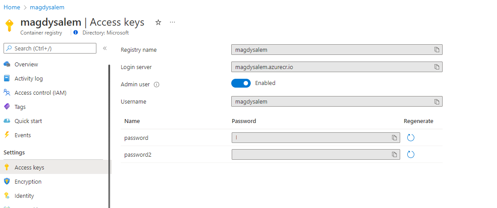
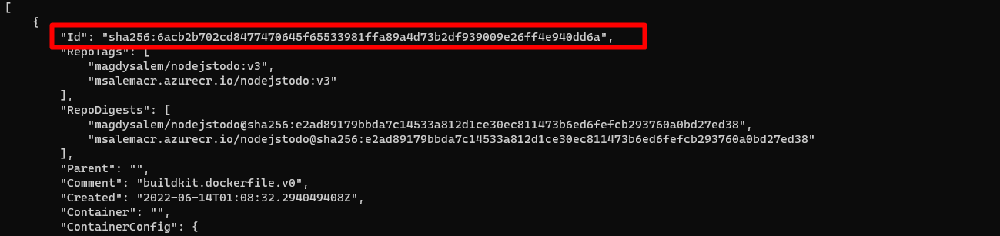

---
# Page settings
layout: default
keywords: Azure Marketplace Container Offer Mastering the Marketplace
comments: false

# Micro navigation
micro_nav: false

hide:
- navigation
---

[Home](/) > [Container Offers](../../index) > [Labs](../../index.md#labs) 🧪

# Lab 2 - Prepare Container Deployment

> **Note:** This lab is part of a series of labs for Mastering Container Offers Workshop. You must finish this lab before moving on to the next sections.

This lab will take you from start to finish in getting your artifacts ready for publication of your Container Offer.

<!-- no toc -->
- [Getting started](#getting-started)
- [Prepare Solution Images](#prepare-solution-images)
- [Run Containers Locally](#run-containers-locally)
- [Push Images to ACR](#push-images-to-acr)
- [Create Helm Chart](#create-helm-chart)
- [Create UI Definition](#create-ui-definition)
- [Create Cluster Template](#create-cluster-template)
- [Update the Package Manifest File](#update-the-package-manifest-file)

---

## Getting started

> ⚠️ You must have completed all [prerequisites](../prerequisites/index.md) before continuing with this lab.

### Azure Container Registry (ACR)

If **Admin user** is not enabled on your ACR, select **Settings > Access** keys in the left menu and enable it in the Azure portal as shown in the following image.
   


Capture the following values as you will need them throughout the remainder of the labs.
  
  - Login server
  - Username
  - Password

### ❗Your working folder

This section is extrememly important for working easily through the labs.

You will be working with one solution throughout all the labs. To make it easier to work with the solution, you will make a copy of the solution folder and move it to a location of your choice outside the Git repository folder that holds these labs.

1. Copy the folder `<path to Git repo>/docs/container/lab2-prepare-container-deployment/begin`.
2. Copy this folder to a location of your choice. `c:\projects\begin` for example.
3. Rename the `begin` folder to `container-labs`.
4. From now on, the labs will refer to `container-labs` when referring to your working folder.

## Prepare Solution Images

In this section, you will create a `DockerFile` for solution `Azure ToDo` and publish the image to your ACR created in [the prerequisites exercise](../prerequisites/index.md). The sample solution is a simple to-do application that is already completed for you. The intent of this lab is not to have you write code, but to prepare your container offer artifacts.

1. Using your text editor, open the following Dockerfile.
    
        container-labs/code/Dockerfile

2. Add the following code to the Dockerfile taking care not to delete the first line.
        
        # Create app directory
        WORKDIR /usr/src/app

        # Copy solution package file
        COPY package*.json ./

        # Install app dependencies
        RUN npm install

        # Copy all files
        COPY . .

        # Add command to expose web app port 
        EXPOSE 3000

        # Command to start the application
        CMD [ "npm", "start" ]

3. Ensure Docker Desktop is running. 
4. Open a terminal window (WSL2 on Windows) and run the following commands to login into ACR server. 

        docker login <ACR Login Server Name> -u <ACR admin> -p <ACR password>

5. Run the following commands to build the image.

        cd `container-labs\code`
        docker build -t <ACR Login Server Name>/todojs:v1 .

6. The solution uses MongoDB for storage. You're going to run MongoDB in another container.
   
    Run the following commands to pull mongodb image locally and tag it.

        docker pull mongo:latest 
        docker tag mongo:latest <ACR Server name>/mongo:latest

7. If you enter the following command, you should see the two local images prefixed with your ACR name.

        docker images

## Run Containers Locally

In this section we will run the solution locally with Docker. 

1. Start by running MongoDB locally. Specify an `admin username` and `password` of your choice for the mongoDB instance. 
    
        docker run -d -e MONGO_INITDB_ROOT_USERNAME:<admin username> -e MONGO_INITDB_ROOT_PASSWORD:<password> -p 27017:27017 --name mongotodo  mongo:latest
    
1. Start the main web application 
    
        docker run -d --link mongotodo:mongotodo -p 3000:3000 -e ENVIRONMENT:development -e DATABASE_NAME:azure-todo-app -e DATABASE_URL=mongodb://mongotodo:27017 <ACR Login Server Name>/todojs:v1 
    
1. Verify the containers are running correctly. Run the following command to see the two containers.
    
        docker ps

1. Browse the web application by going to <a href="http://localhost:3000" target="_blank">http://localhost:3000</a>

1. Try to create and delete tasks to make sure site is running properly
   
## Push Images to ACR

In this section we will publish or **push** the solution images to the ACR you created in prerequisites.

```
docker push <ACR Server name>/todojs:v1
docker push <ACR Server name>/mongo:latest
```

You can now see the images in your ACR. 

1. Open the <a href="http://portal.azure.com" target="_blank">Azure portal</a> and browse to your ACR. 
2. In the left menu, select **Services > Repositories**.
3. You should see an a view like the following image.

    

## Create Helm Chart

In this section will explore the Helm Chart directory `AzureToDo`.

> **About Helm**
>
> Helm is the package manager for Kubernetes. In other words, it is used to help you manage Kubernetes applications. Helm is K8s equivalent of `yum` or `apt`. Helm deploys charts, which you can think of as a packaged application.

1. Open  `container-labs\container-package\AzureToDo\values.yaml` in your text editor.
2. Update lines 10 & 14 with your ACR server name. For example `myacr.azureacr.io`.
3. Get the image digest of your `todojs:v1` image.
   
    > **Image Digest** 
    > 
    > The image digest is the hash of the image index or image manifest JSON document.
   
    To get image digest of your `todojs:v1 ` image run following command.

         docker inspect image <ACR Server name>/todojs:v1 

4. Locate the value of the `Id` key and copy it.

    
    
5. Paste the Id value onto line 8.
6. Update line 12 with `mongo:latest` image digest. To get image digest run following command.
   
        docker inspect image <ACR Server name>/mongo:latest

7. Under section `MongoDB Admin` Add the following key/value pairs.
    
        mongoDBAdmin: <enter admin name>
        mongoDBPassword: <enter password>
    
   
8. Open the following file in your editor.
    
        container-labs\container-package\AzureToDo\templates\deployments.yaml

9.  Uncomment Line 25 and add the following.
    
        value: {{ .Values.mongoDBPassword }}

10. Uncomment Line 27 and add the following.
    
        value: {{ .Values.mongoDBAdmin }}

You are done preparing the Helm chart files.

## Create UI Definition

In this section will update the `createUIDefinition.json` file.

> **About `createUIDefinition.json`**
>
> The createUIDefinition.json file is used to customize the customer's interface during the installation process. It allows for various controls to be shown on the screen to collect values needed to install the application.

1. Open the following file in your editor. 
   
    `container-labs\container-package\createUIDefinition.json`

3. Go to Line 76 and replace `// Add Mongo DB Admin and password Here` with the following JSON.
   
        {
            "name": "mongoDBAdmin",
            "type": "Microsoft.Common.TextBox",
            "label": "mongoDBAdmin",
            "defaultValue": "",
            "constraints": {
            "required": true
            }
        }, 
        {
            "name": "mongoDBPassword",
            "type": "Microsoft.Common.PasswordBox",
            "label": "mongoDBPassword",
            "defaultValue": "",
            "constraints": {
            "required": true
            }
        },

    This JSON introduces two controls that will collect the admin username and password for the MongoDB container that will be created upon installation.

4. Go to line 131 in the `outputs` section and paste the following JSON.
    
        "app-mongoDBAdmin" : "[steps('ExtensionConfiguration').mongoDBAdmin]",
        "app-mongoDBPassword" : "[steps('ExtensionConfiguration').mongoDBPassword]",

    This JSON adds the values collected by the new UI controls to the output of the `createUIDefinition.json` file. These values are passed along to the ARM template that creates the resources being deployed.

## Create Cluster Template

In this section you will modify the cluster deployment file.

> **About the cluster deployment file**
>
> The `cluster-deployment.json` is an ARM template, used for deploying resources into Azure. This file receives the output of `createUIDefinition.json` as input parameters.

1. Open the following file in your editor.
   
    `container-labs\container-package\cluster-deployment.json`

2. add the following parameters to the parameters section.
    
        "app-mongoDBAdmin": {
            "type": "string",
            "metadata": {
                "description": "Enter Mongo DB password"
            }
        },
        "app-mongoDBPassword": {
            "type": "secureString",
            "metadata": {
                "description": "Enter Mongo DB Admin"
            }
        },

## Update the Package Manifest File

> **About manifest.yaml**
>
> The Kubernetes manifest file defines the configuration for a deployment. Many fields may be defined in the manifest file that specify details of creating pods, minimum pods in a cluster, scalability, and other settings.

In this section you will update the **manifest.yaml** file.

1. Open the following file in your editor.

    `container-labs\container-package\manifest.yaml`

2. Go to `registryServer:` and add your ACR server name.

**Congratulations!** You have now finished this lab and your deployment files are ready for next steps.

[Continue to Lab 3](../lab3-create-cnab-bundle-package/index.md)