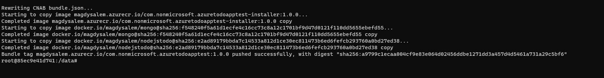
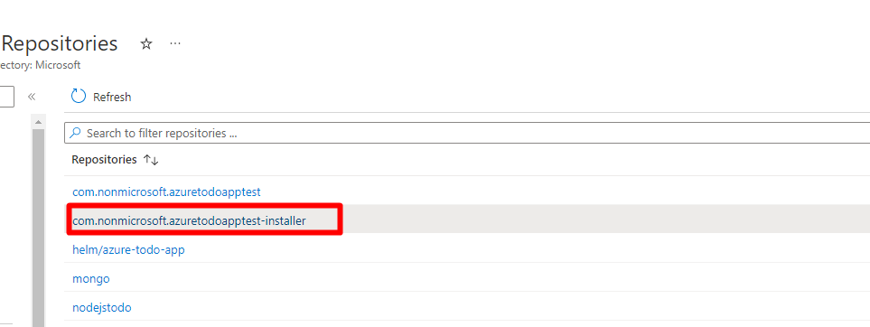
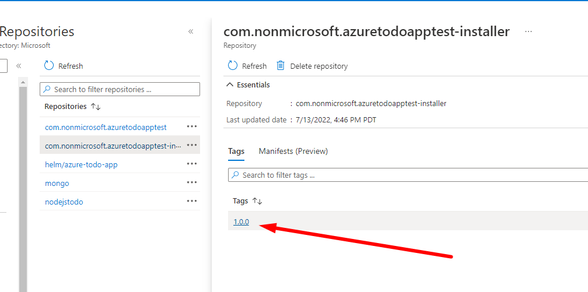

---
# Page settings
layout: default
keywords: Azure Marketplace Container Offer Mastering the Marketplace
comments: false

# Micro navigation
micro_nav: false

hide:
- navigation
---

[Home](/) > [Container Offers](../../index) > [Labs](../../index.md#labs) 🧪

# Lab 3 - Create CNAB Bundle

> **Note:** This lab is part of a series of labs for Mastering Container Offers Workshop. You must finish this lab before moving on to the next sections.

In this lab, you pull pull the CNAB bundler image and use it to create a CNAB bundle from the files you've prepared.

<!-- no toc -->
- [Download Microsoft's CNAB image](#download-microsofts-cnab-image)
- [Create and Upload the CNAB Bundle](#create-and-upload-the-cnab-bundle)
- [Verify the published bundle image](#verify-the-published-bundle-image)

---

## Download Microsoft's CNAB image

> **About the Microsoft CNAB image**
>
> The Microsoft CNAB Docker image contains all the tools needed to turn the files you've created into a CNAB package. This image exists because the opensource CNAB standards are changing frequently and this image is kept up to date with the latest tools to enable you to build a CNAB bundle without all of the manual steps needed.

1. Open terminal and run the following command to download Microsoft's CNAB builder image.

        docker pull mcr.microsoft.com/container-package-app:latest

    > 🗒️ It may take a few minutes to download the image

## Create and Upload the CNAB Bundle

1. You'll now start the the CNAB container in interactive mode, sharing a volume. Provide the full path to your `container-labs` directory where indicated. 
   
    Below is an example of this command.

            docker run -it -v /var/run/docker.sock:/var/run/docker.sock -v /mnt/c/Users/david/projects/container-labs:/data --entrypoint "/bin/bash" mcr.microsoft.com/container-package-app:latest

    The following is the command to run. Replace [path to container-labs] with your complete path from the root of your drive.

            docker run -it -v /var/run/docker.sock:/var/run/docker.sock -v [path to container-labs]:/data --entrypoint "/bin/bash" mcr.microsoft.com/container-package-app:latest

    > After the container starts, you will be on the command line in the `container-package-app` container itself. Commands executed here will run within the container.

2. Run the following docker command to ensure the `mcr.microsoft.com/container-package-app:latest` container is running.

        docker ps

3. Run the following command to enter the shared volume.

        cd data

4. Run the following to go into the `container-package` folder.

        cd container-package

5. Run the following commands to login to Azure and into your ACR.

        az login
        az acr login -n <ACR Server> -u <ACR Admin> -p <ACR password>

6. Run the following command in the container terminal to start building the CNAB bundle and push it to the ACR you defined in the manifest file.

        cpa buildbundle

  ⚠️ The `cpa buildbundle` command may take some time to complete. 

  When you see output similar to that shown in the below image, the command has completed.

  

## Verify the published bundle image

Now that the CNAB bundle has been built, you'll ensure it is in place in your ACR.

1. Log into Azure Portal 
2. Open your ACR resource
3. Click on **Services > Repositories**
4. You will the see `com.nonmicrosoft.azuretodoapptest-installer` bundle.
  
    

5. Click on AzureToDo-installer bundle then click on Tag
  
    

6. Click the tag to inspect the manifest
  
    

**Congratulations!** You have created and uploaded a CNAB bundle. You have also finished this lab.

[Continue to Lab 4](../lab4-publishing-container-offer/index.md)