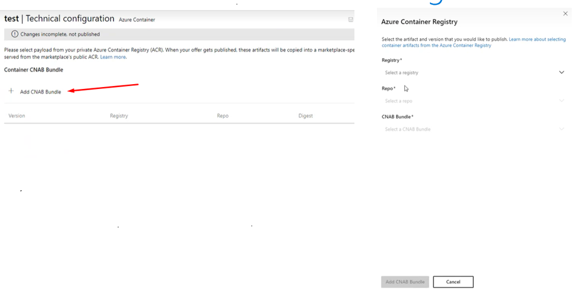

---
# Page settings
layout: default
keywords: Azure Marketplace Container Offer Mastering the Marketplace
comments: false

# Micro navigation
micro_nav: false

title: Lab 4

hide:
- navigation
---

[Home](/) > [Container Offers](../../index) > [Labs](../../index.md#labs) 🧪

# Lab 4 - Publishing the Container Offer

> **Note:** This lab is part of a series of labs for Mastering Container Offers Workshop. You must finish this lab before moving on to the next sections.

In this lab, you will complete the rest of the required setup on Partner Center to publish your offer. The only section that should need completion in Partner Center is Plan Overview. If you have any other sections pending completion, please complete them before moving on to this lab.

<!-- no toc -->
- [Create a plan on Partner center](#create-a-plan-on-partner-center)
- [Review and Publish](#review-and-publish)

## Create a plan on Partner center

### Plan overview

1. Go to your Partner Center account inside the Container offer you created earlier.
2. Select the **Plan overview** section and click on **New Plan**. Give your plan a unique `Plan Id` and `Plan name` and click Create.
3. In the **Plan listing** tab, give your plan a name, description and summary.
4. Click **Save Draft**.

### Pricing and availability

1. Open the **Pricing and availability** tab.
1. For the **Edit Market** section, select at least one market in which to sell your product. This is typically the United States.
1. Under **Pricing**  select  **Custom price**.
1. Select **Per Core** and enter price as **0** USD/hour. For this workshop, you don't want to charge your account when testing.
1. Switch the plan visibility to **Private** and put in the **Tenant Id** of the tenant that will be buying the plan. For this practice workshop, the tenant is typically the same that holds your ACR and AKS services.
1. Click **Save Draft**.
    
### Technical configuration
    
1. Go to the **Technical Configuration** tab. 
2. For the Cluster extension type, enter `**YOUR-COMPANY-NAME**.AzureToDoApp'.
3. Click the **Add CNAB Bundle** link and the **Azure Container Registry** dialog appears.
      
      

4. Select your ACR as **Registry**.
5. For **Repo** select `com.nonmicrosoft.azuretodoapptest-installer`.
6. For **CNAB Bundle**, select the `1.0.0` version you published earlier.
7. Click **Add CNAB Bundle**.
8. Click **Save draft**.

## Review and Publish

Finally click the **Review and publish** button. 

You should now see green checkmarks against all the sections and you are now ready to publish. Click on **Publish** at the bottom to start the publishing process.

It will take a while for the offer to publish before you can move on to the next lab.

**Congratulations!** You have now finished this lab.

[Continue to Lab 5](../lab5-purchasing-container-offer/index.md)