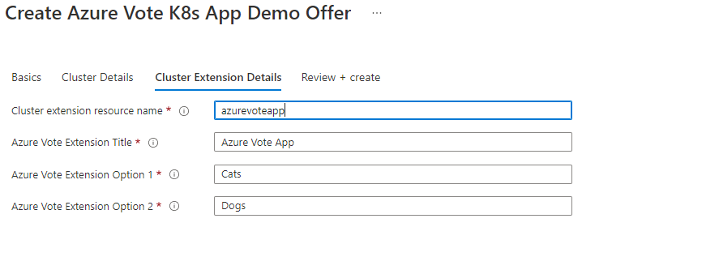
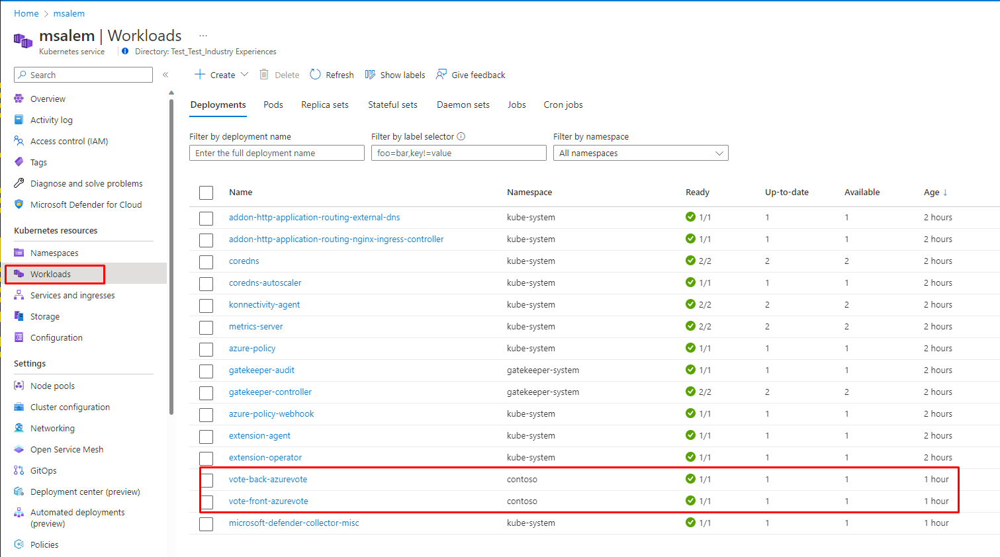

---
# Page settings
layout: default
keywords: Azure Marketplace Container Offer Mastering the Marketplace
comments: false

# Micro navigation
micro_nav: false

title: Lab 4

hide:
- navigation
---

[Home](../../../) > [Container Offers](../../) > [Labs](../../index.md#labs) 🧪

# Lab 4 - Purchasing the Container Offer

> **Note:** This lab is part of a series of labs for Mastering Container Offers Workshop. 

This lab puts you in the role of a customer who will purchase the offer you have published. 

<!-- no toc -->
- [Purchase your Offer](#purchase-your-offer)

---

> **Note:** If the your offer is not published yet please proceed to [Purchase Azure Vote Offer](#purchase-azure-vote-offer)
## Purchase your Offer
1. You created an AKS cluster in the prerequisites to these labs. If that AKS cluster is stopped, **start it**.
2. Open [Azure Portal Marketplace](https://portal.azure.com/#view/Microsoft_Azure_Marketplace/MarketplaceOffersBlade/selectedMenuItemId/home) in your browser.
3. Search for **Azure Vote K8s App Demo Offer** then click on Offer to  **Create**. 
4. Select **Test Plan**  and click **Create**.
5. Under the **Basics** tab, Select the Subscription and Resource Group 
6. Under the **Cluser Details** tab, Select the cluster we created in [Lab0](../prerequisites/)
7. Under the **Cluster Extension Details** Fill all the missing fields. 

   

## Access Azure Vote Solution
1. In **Azure Portal** Open your Cluster blade
   
   

1. Click on **Workloads** to verify **Azure Vote** Pods are up and running
   
   

1. Click on **Servoces and Ingresses** to locate **Azure-vote-front** service and Click on **External IP Address**

   

1. Azure Vote front app will load on new Tab

   

## Purchase Azure Vote Offer
1. You created an AKS cluster in the prerequisites to these labs. If that AKS cluster is stopped, **start it**.
2. Open [Azure Portal Marketplace](https://portal.azure.com/#view/Microsoft_Azure_Marketplace/MarketplaceOffersBlade/selectedMenuItemId/home) in your browser.
3. Search for **Azure Vote K8s App Demo Offer** then click on Offer to  **Create**. 
4. Select **Test Plan**  and click **Create**.
5. Under the **Basics** tab, Select the Subscription and Resource Group 
6. Under the **Cluser Details** tab, Select the cluster we created in [Lab0](../prerequisites/)
7. Under the **Cluster Extension Details** Fill all the missing fields. 

   

## Access Azure Vote Solution
1. In **Azure Portal** Open your Cluster blade
   
   

1. Click on **Workloads** to verify **Azure Vote** Pods are up and running
   
   

1. Click on **Servoces and Ingresses** to locate **Azure-vote-front** service and Click on **External IP Address**

   

1. Azure Vote front app will load on new Tab

   

## Purchase Azure Vote Offer
1. You created an AKS cluster in the prerequisites to these labs. If that AKS cluster is stopped, **start it**.
2. Open [Azure Portal Marketplace](https://portal.azure.com/#view/Microsoft_Azure_Marketplace/MarketplaceOffersBlade/selectedMenuItemId/home) in your browser.
3. Search for **Azure Vote K8s App Demo Offer** then click on Offer to  **Create**. 
4. Select **Test Plan**  and click **Create**.
5. Under the **Basics** tab, Select the Subscription and Resource Group 
6. Under the **Cluser Details** tab, Select the cluster we created in [Lab0](../prerequisites/)
7. Under the **Cluster Extension Details** Fill all the missing fields. 

   

## Access Azure Vote Solution
1. In **Azure Portal** Open your Cluster blade
   
   

1. Click on **Workloads** to verify **Azure Vote** Pods are up and running
   
   

1. Click on **Servoces and Ingresses** to locate **Azure-vote-front** service and Click on **External IP Address**

   

1. Azure Vote front app will load on new Tab

   

**Congratulations!** You have now successfully completed this lab as well as purchased the offer the you created. 

This is the last lab in the lab series.