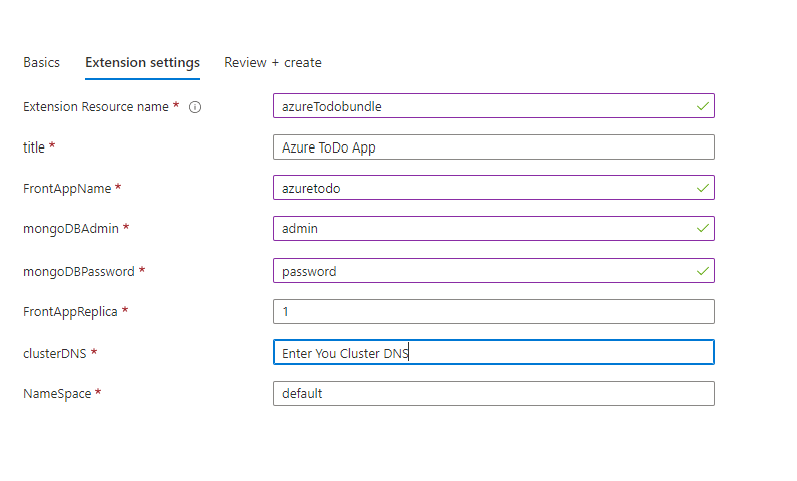

---
# Page settings
layout: default
keywords: Azure Marketplace Container Offer Mastering the Marketplace
comments: false

# Micro navigation
micro_nav: false

title: Lab 5

hide:
- navigation
---

[Home](../../../) > [Container Offers](../../) > [Labs](../../index.md#labs) 🧪

# Lab 5 - Purchasing the Container Offer

> **Note:** This lab is part of a series of labs for Mastering Container Offers Workshop. You must finish this lab before moving on to the next sections.

This lab puts you in the role of a customer who will purchase the offer you have published.

<!-- no toc -->
- [Purchase your Offer](#purchase-your-offer)

---

## Purchase your Offer

1. You created an AKS cluster in the prerequisites to these labs. If that AKS cluster is stopped, **start it**.
2. Open [Partner Center](https://partner.microsoft.com/en-us/dashboard/marketplace-offers/overview) in your browser.
3. Navigate to the **Offer Overview** page and click the offer you created earlier.
4. Select the plan you want to purchase from the drop down list and click **Create**.
5. Under the **Basics** tab, configure the Subscription, Resource Group and Cluster name. You will select the cluster we created in [Lab0](../prerequisites/)
6. Under the **Extension Setting** Fill all the missing fields. 

    

## TODO: Access Solution

Add section to access the solution running on AKS

**Congratulations!** You have now successfully completed this lab as well as purchased the offer the you created. 

This is the last lab in the lab series.