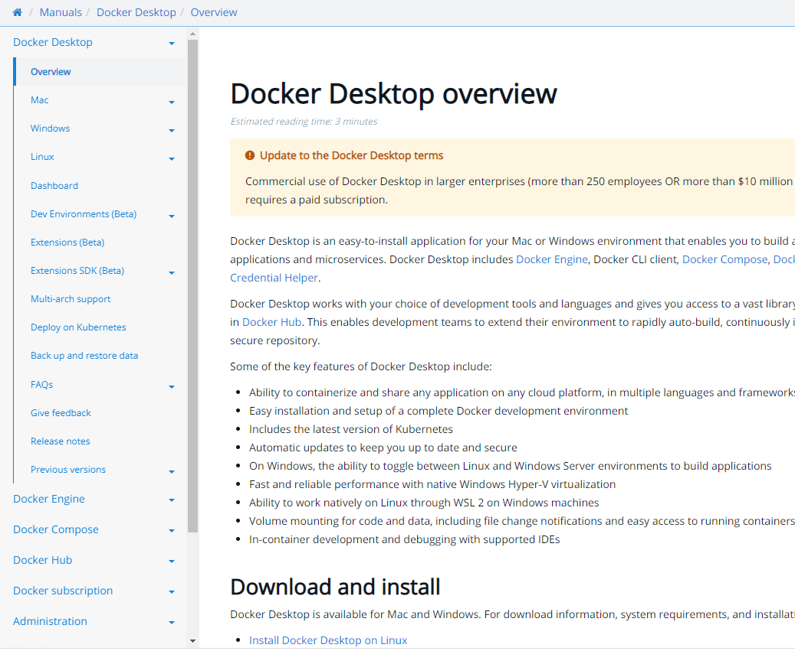

---
# Page settings
layout: default
keywords: Azure Marketplace Container Offer
comments: false

# Hero section
description: Container Lab Prerequisites

# Micro navigation
micro_nav: false

hide:
- navigation
---

[Home](../../../) > [Container Offers](../../../container/index.md) > [Prerequisites](./index.md)

# Install Docker Desktop

Install Docker Desktop locally if you don't already have it.

1. Go to [Download and install](https://docs.docker.com/desktop/#download-and-install).
2. Choose your operating system and follow the instructions

    