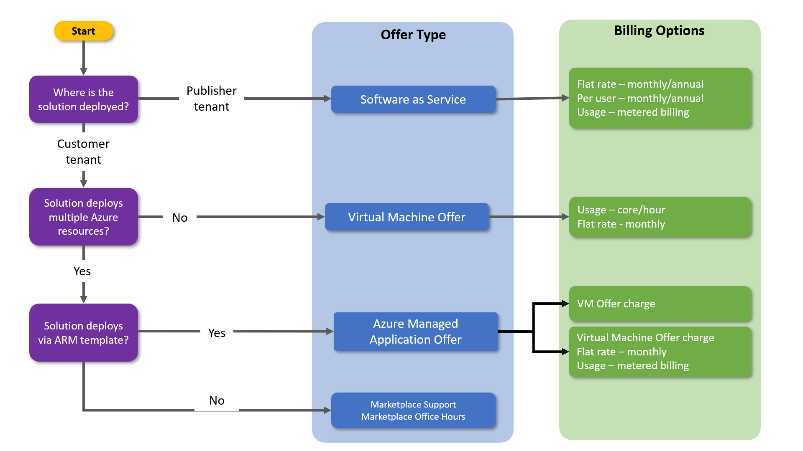

---
# Page settings
layout: default
keywords: Azure AppSource Marketplace SaaS
comments: false

title: Find your offer type

hide:
  - navigation
---

[Home](../index.md)

# Choosing Your Offer Type

[✉️](https://forms.office.com/r/0gCrzhSMkw) [Let us know what you need](https://forms.office.com/r/0gCrzhSMkw) from this content, or tell us how we're doing.

## Table of Contents

<!-- no toc -->
- [Offer type selection video](#offer-type-selection-video)
- [Decision tree](#decision-tree)
- [More resources and information](#more-resources-and-information)

 
## Offer type selection video

<a target="_blank" href="https://go.microsoft.com/fwlink/?linkid=2207811">Video</a>

Are you unsure of which type of offer you need to bring your solution to the Microsoft commercial marketplace? This video walks you through the types and some things about them to help you make the decision of what offer type is best for you.

## Decision tree

Building on top of the above video, follow the questions in the below image to find the right offer type for you. 

## More resources and information

### Microsoft docs

- <a target="_blank" href="https://docs.microsoft.com/azure/marketplace/publisher-guide-by-offer-type">Publishing guide by offer type</a>
- <a target="_blank" href="https://docs.microsoft.com/en-us/azure/marketplace/marketplace-commercial-transaction-capabilities-and-considerations#transact-overview">The transact overview</a> helps you understand some of the differences between transactable offer types.

### SaaS offers
SaaS offers allow for software that is delivered as SaaS to be transacted on the Azure Marketplace.

- A SaaS offer runs in the publisher’s tenant
- Supports metered billing
- Requires some integration with marketplace SaaS APIs

🚦Learn more about SaaS offers [here](../learning-paths/saas-offers.md).

⏯️ Experience the SaaS Accelerator course [here](../saas-accelerator/index.md).

### Virtual Machine offers

Virtual Machine offers allow publishers to install their software on a virtual machine.

- Runs in the customer’s tenant and subscription
- Pricing is based on usage of the product
- Does not support metered billing

🚦Learn more about Virtual Machine offers [here](../learning-paths/virtual-machine-offers.md).

### Azure Managed Application offers

- Runs in the customer’s tenant
- Enables the publisher to manage the resources in the customer’s tenant
- Deploys via an ARM template
- Supports metered billing

🚦Learn more about Managed Application offers [here](../learning-paths/ama-offers.md).

