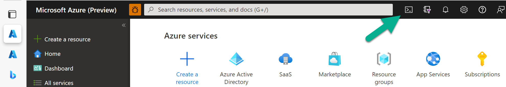

# Lab 1: Installing the SaaS Accelerator

This lab takes you through a very quick installation process for the SaaS Accelerator using the Azure portal Cloud Shell.

## Exercise: Create an install document

Open your favorite text editor and paste the following PowersShell script into a text file.

```powershell
git clone https://github.com/Azure/Commercial-Marketplace-SaaS-Accelerator.git -b main --depth 1; `
 cd ./Commercial-Marketplace-SaaS-Accelerator/deployment/Templates; `
 Connect-AzureAD -Confirm; .\Deploy.ps1 `
 -Location "East US" `
 -PathToARMTemplate ".\deploy.json",
 -PublisherAdminUsers "ADMIN_USER_EMAIL" `
 -ResourceGroupForDeployment "RESOURCE_GROUP" `
 -SQLAdminLogin "SQL_ADMIN_USER_NAME" `
 -SQLAdminLoginPassword "SQL_PASSWORD" `
 -SQLServerName "SQL_SERVER_NAME" `
 -WebAppNamePrefix "WEB_NAME_PREFIX"
 ```

### Defined values

In your text editor, replace each of the ALL_CAPS values. They are described below.

**ADMIN_USER_EMAIL** - The email of the admin for the SaaS solution that will be deployed. This should be an email tied to an Azure subscription.

**RESOURCE_GROUP** - The name of the resource group you want to deploy the SaaS solution into. For the purposes of this lab, consider using `saas-accelerator-lab`.

**SQL_ADMIN_USER_NAME** - The admin username for the SQL Server that will be installed. Do NOT use name "admin" as it is not allowed and the deployment script will fail.

**SQL_PASSWORD** - The password for the SQL Server instance that will be installed. Make this password secure and at **least 22 characters long** so the deployment script doesn't fail.

**SQL_SERVER_NAME** - The name of the SQL Server instance that will be deployed.

**WEB_NAME_PREFIX** - A string that will be prefixed to the name of all resources that are created in your deployment resource group. This can be as short as three letters.

### Optional parameters

The following values are optional and typically used for a more controlled deployment. We will not be using these parameters in this lab, but you can experiment with them on your own.

```powershell
-TenantID "xxxx-xxx-xxx-xxx-xxxx" `
-AzureSubscriptionID "xxx-xx-xx-xx-xxxx" `
-ADApplicationID "xxxx-xxx-xxx-xxx-xxxx" `
-ADApplicationSecret "xxxx-xxx-xxx-xxx-xxxx" `
-ADMTApplicationID "xxxx-xxx-xxx-xxx-xxxx" `
-LogoURLpng "https://company_com/company_logo.png" `
-LogoURLico "https://company_com/company_logo.ico"
```

## Exercise: Opening the cloud shell

In the Azure portal, click the button next to the command bar as shown in the image below.



This opens the the PowerShell cloud shell, which is a command line that runs directly in Azure. Note the cloud shell is ready to use once you see a blinking cursor.

## Exercise: Running the install script

1. Go back to your PowerShell script in your text editor. The command should be completed and ready to run.
1. Copy the entire command into your copy/paste buffer.
1. Go back to the Azure portal in your browser and **right click** on the command shell window.
1. Select **Paste as plain text**.
1. If the script doesn't start running automatically, hit **Enter**.

The script will take several minutes to run.

If you see errors in the output of the script, cancel the run of the script by typing **CTRL+C**. Fix the errors and run the script again using a different RESOURCE_GROUP to avoid collisions of resources during install.

Once the script completes, you may close the cloud shell by clicking the cloud shell button you used to open it.

**Congratulation!** You have finished this lab.

If you are in a live class setting, please raise your hand in Microsoft Teams to indicate you are done with the lab.
