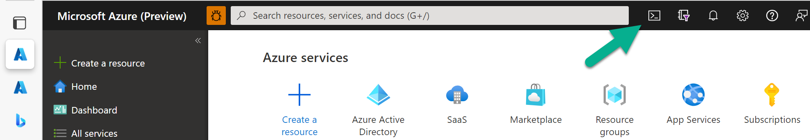

# Lab 2: Installing the SaaS Accelerator

This lab takes you through a very quick installation process for the SaaS Accelerator using the Azure portal Cloud Shell. Once complete, you will have installed the SaaS Accelerator and published your offer in Partner Center.

## Exercise: Create an install document

Open your favorite text editor and paste the following PowersShell script into a text file.

```powershell
git clone https://github.com/Azure/Commercial-Marketplace-SaaS-Accelerator.git -b main --depth 1; `
 cd ./Commercial-Marketplace-SaaS-Accelerator/deployment/Templates; `
 Connect-AzureAD -Confirm; .\Deploy.ps1 `
 -Location "East US" `
 -PathToARMTemplate "./deploy.json" `
 -PublisherAdminUsers "ADMIN_USER_EMAIL" `
 -ResourceGroupForDeployment "RESOURCE_GROUP" `
 -SQLAdminLogin "SQL_ADMIN_USER_NAME" `
 -SQLAdminLoginPassword "SQL_PASSWORD" `
 -SQLServerName "SQL_SERVER_NAME" `
 -WebAppNamePrefix "WEB_NAME_PREFIX"
 ```

### Defined values

In your text editor, replace each of the ALL_CAPS values. They are described below.

| Parameter value | Description and notes |
|---|---|
| **ADMIN_USER_EMAIL** | The email of the admin for the SaaS solution that will be deployed. This should be an email tied to an Azure subscription. |
| **RESOURCE_GROUP** | The name of the resource group you want to deploy the SaaS solution into. For the purposes of this lab, consider using `saas-accelerator`. |
| **SQL_ADMIN_USER_NAME** | The admin username for the SQL Server that will be installed. Do NOT use name "admin" as it is not allowed and the deployment script will fail. |
| **SQL_PASSWORD** | The password for the SQL Server instance that will be installed. Make this password secure and at **least 22 characters long** so the deployment script doesn't fail. Do not use hyphens. |
| **SQL_SERVER_NAME** | The name of the SQL Server instance that will be deployed. The name can only contain lowercase letters. |
| **WEB_NAME_PREFIX** | A string that will be prefixed to the name of all resources that are created in your deployment resource group. This can be as short as three letters. Use lowercase alphanumeric characters only. |

### Optional parameters

The following values are optional and typically used for a more customized deployment. We will not be using these parameters in this lab, but you can experiment with them on your own.

```powershell
-TenantID "xxxx-xxx-xxx-xxx-xxxx"
-AzureSubscriptionID "xxx-xx-xx-xx-xxxx"
-ADApplicationID "xxxx-xxx-xxx-xxx-xxxx"
-ADApplicationSecret "xxxx-xxx-xxx-xxx-xxxx"
-ADMTApplicationID "xxxx-xxx-xxx-xxx-xxxx"
-LogoURLpng "https://company_com/company_logo.png"
-LogoURLico "https://company_com/company_logo.ico"
```

[See here](https://github.com/Azure/Commercial-Marketplace-SaaS-Accelerator/blob/main/docs/Installation-Instructions.md#parameters) for explanations of all parameters.

## Exercise: Opening the cloud shell

In the Azure portal, click the button next to the command bar as shown in the image below.



This opens the the PowerShell cloud shell, which is a command line that runs directly in Azure. Note the cloud shell is ready to use once you see a blinking cursor.

## Exercise: Running the install script

1. Go back to your PowerShell script in your text editor. The command should be completed and ready to run.
1. Copy the entire command into your copy/paste buffer.
1. Go back to the Azure portal in your browser and **right click** on the command shell window.
1. Select **Paste as plain text**.
1. If the script doesn't start running automatically, hit **Enter**.

The script will take several minutes to run. It may reach a point where it seems nothing is happening, but just wait through the entire install. It typically takes eight minutes or so.

### Install script errors

If you see errors in the output of the script, cancel the run of the script by typing **CTRL+C**.

1. Fix the errors in your install script. 
1. Change the `RESOURCE_GROUP` and `WEB_NAME_PREFIX` to new values to prevent collisions.
1. In the cloud shell, do the following.

   ```bash
   # go back to home directory
   cd ~

   # delete the repository directory that was created
   rm -rf ./Commercial-Marketplace-SaaS-Accelerator/
   ```

1. Run the revised script.

### Successful install script

When the script completes successfully, it will print the values you need for the Technical Configuration tab in Partner Center. It will look something like this. Copy this information to a note or file so you can retrieve it in case you close the browser window.

```powershell
__ Add The following URL in PartnerCenter SaaS Technical Configuration->Landing Page section
   https://PREFIX-portal.azurewebsites.net/
__ Add The following URL in PartnerCenter SaaS Technical Configuration->Connection Webhook section
   https://PREFIX-portal.azurewebsites.net/api/AzureWebhook
__ Add The following TenantID in PartnerCenter SaaS Technical Configuration Tenant ID
   e6c97eb2-054c-4b5d-9a30-a064766a9e83
__ Add The following ApplicationID in PartnerCenter SaaS Technical Configuration->AAD Application ID section
   bc830358-8c71-4699-b5e6-ea617ac7b5ee
```

## Exercise: Secrets

The installer did not complete one part of the installation process. The landing page app registration needs a secret that will be shared with the landing page web application. Here you will create that secret and configure it with the web application.

1. In the command bar at the top fo the Azure portal type "App reg" and select App registrations from the menu.
1. CLick the **All applications** tab.
1. Find the registration named **PREFIX-FulfillmentApp** and click it.
1. In the left menu under **Manage**, click the **Certificates and secrets** menu item.
1. Click **+ New client secret**.
1. Enter a name for your secret, like "secret1."
1. Copy the **Value** of the secret and copy it somewhere you can access it again. You won't have another chance to copy this secret.
1. Browse to the resource group you created during installation, `saas-accelerator`. You see the resources created inside the resource group.

### The portal secret

1. Click the App service named **PREFIX-portal**.
1. In the left menu, under **Settings** click the **Configuration** menu item.
1. Scroll down and click the `SaaSApiConfiguration__ClientSecret` application setting.
1. In the **Value** field, paste in the secret you created earlier.
1. Click the **OK** button.
1. Click the **Save** button on the upper menu.
1. Click the **Continue** button to allow the web app to restart.

### The admin secret

1. Click the App service named **PREFIX-admin**.
1. In the left menu, under **Settings** click the **Configuration** menu item.
1. Scroll down and click the `SaaSApiConfiguration__ClientSecret` application setting.
1. In the **Value** field, paste in the secret you created earlier.
1. Click the **OK** button.
1. Click the **Save** button on the upper menu.
1. Click the **Continue** button to allow the web app to restart.

## Exercise: Verify web applications

Now you'll verify the two web application are up and running.

### The landing page

1. In the SaaS Accelerator's resource group, find the App service for the landing page and click it. It is the one named **PREFIX-portal**.
1. In the upper right corner is the URL of the web app. Click the URL.
1. You should be taken to a web page and receive no errors.

### The publisher portal

1. In the SaaS Accelerator's resource group, find the App service for the landing page and click it. It is the one named **PREFIX-admin**.
1. In the upper right corner is the URL of the web app. Click the URL.
1. You should be taken to a web page and receive no errors. If you are prompted to log in, do so.

## Exercise: Partner Center Technical Configuration

1. Open Partner Center and browse to the **Technical configuration** page of your offer.
1. Enter the values into the appropriate text fields as per the instructions from the end of the installation script that you copied earlier in this lab.
1. Click **Save Draft**.
1. Click **Review and publish**.
1. Publish your offer.

Publication will take a while. Only after publication completes can you do the next lab.

**Congratulation!** You have finished this lab.

If you are in a live class setting, please raise your hand in Microsoft Teams to indicate you are done with the lab.

> To watch the publication process, refresh the offer's **Overview** page occasionally. Once your offer reaches the **Publisher preview** stage, you are ready for the next lab. Do NOT press the **Go live** button.
