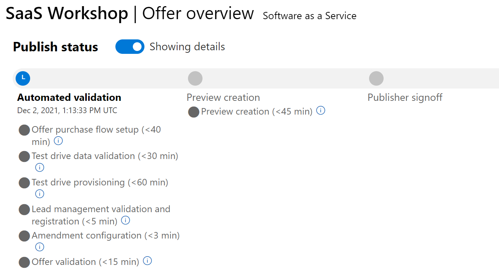

> **This lab is incomplete and in active development. It is not ready for use at this time.**

# Lab 2: Create a Landing Page

In this lab you will build on what you accomplished in [Lab 1: Creating a SaaS Offer in Partner Center](../lab1-create-pc-offer/README.md). You will deploy a landing page and integrate it with your Partner Center SaaS Offer, enabling publishing of the offer and purchasing the offer in the **Preview** stage of the publication pipeline.

For this lab you will need the following.

1. An offer configured in [Partner Center](https://partner.microsoft.com/en-us/dashboard) as per Lab 1
1. An Azure account and access to the [Azure portal](https://portal.azure.com/)
1. Visual Studio 2022 or 2019 (any version)
1. Git (optional)

> **Note:** It is possible to complete this using Visual Studio Code, but the instructions will be tailored for using Visual Studio 2022.

## Exercise: Compile the Visual Studio Solution

There are three projects in the solution you'll be working with. You will deal with them one at a time over the course of the labs. In this lab, we will start with the landing page project.

1. Clone this repository or download a ZIP file of it's contents and UNZIP them on your machine.

    https://github.com/microsoft/Mastering-the-Marketplace

2. Using Visual Studio 2022 open the following solution file on your machine. Take care to choose the **begin** folder.

    `**\Mastering-the-Marketplace\saas\labs\lab-code\begin\SaaSLabsBegin.sln`

3. Build the solution. You should get no build errors.

## Exercise: Create Application Registrations

In this exercise, you will create two application registrations in the Azure portal. One will be single-tenant and used to connect to the SaaS API. The other will be multi-tenant and be used to authenticate users coming to your Landing Page.

### Create a single-tenant Application Registration

1. Log in to the Azure portal.
1. In the top-of-center command window in the portal, type "app reg" and select the item "App registrations" that appears. You will see a list of current application registrations.
1. At the top of the page click the **+ New registration** link. You are taken to the **Register an application page**.
1. For the purposes of this lab, use `saas-workshop-single-tenant` as the name of this app registration.
1. At the bottom of the page, click the **Register** button.

#### **Add a secret**

Here you will add a secret to the app registration. Make sure to copy and paste the secret value somewhere you can access it later.

1. Click into the **saas-workshop-single-tenant** application registration.
1. In the left-hand menu, find the **Manage** menu and click the **Certificates and secrets** link.
1. Create a new client secret.
    1. Give it a description.
    1. Choose an expiration date. The 6-month default should be fine.
1. Copy the **Value** of the secret and paste it somewhere you can easily access it later.

### Create a multi-tenant Application Registration

1. Register another app registration. For the purposes of this lab, use `saas-workshop-multi-tenant` as the name of this app registration.
1. Under **Supported account types**, select the option: **Accounts in any organizational directory (Any Azure AD directory - Multitenant)**.
1. At the bottom of the page, click the **Register** button.

#### **Add a platform to the multi-tenant app registration**

1. In the left-hand enu under the **Overview** menu item click the **Quickstart** link.
1. Find the **Web application** section and click the **Start** button.
1. Click **ASP.NET Core**.
1. On the resulting Quickstart page, click the **Make this change for me** button.
1. Under the **Configuring your application registration** click the **Make updates** button.
1. In the left-hand menu under the **Manage** section, click the **Authentication** link.

    > Here you can see that two URLS have been added to the Redirect URIs section for you. These allow running your code in debug mode using the default debugger ports.

#### **Create a client secret**

1. Create a a client secret for this app registration.
1. Store is somewhere you can access it later.

## Exercise: appsettings.json

The `appsettings.json` file must be filled out before publishing the application. That's what you'll do in this section.

### The saas-workshop-multi-tenant app registration

All changes in this section occur under the `AzureAD` section of the `appsettings.json` file.

1. In the Landing Page project, open the `appsettings.json` file.
1. In the Azure portal click the **Azure Active Directory** button in the left-hand menu.
1. On the overview page in the **Basic information** section, find the the **Primary domain** and use it to replace `DOMAIN_NAME"` in `appsettings.json`.
1. In the left-hand menu under the **Manage** menu, click the **App registrations** link.
1. Click the `saas-workshop-multi-tenant` app registration.
1. In the `appsetting.json` file, replace `CLIENT_ID` with the **Application (client) ID** from this screen.
1. Replace `CLIENT_SECRET` with the client secret you noted earlier for the `saas-workshop-multi-tenant` app registration.

### The saas-workshop-single-tenant app registration

All changes in this section occur under the `MarketplaceAPI` section of the `appsettings.json` file.

1. Go back to the list of App registrations.
1. Click the `saas-workshop-single-tenant` app registration.
1. In the `appsetting.json` file, replace `CLIENT_ID` with the **Application (client) ID** from this screen.
1. In the `appsetting.json` file, replace `CLIENT_SECRET` with the client secret value you stored earlier.
1. In the `appsetting.json` file, replace `TENANT_ID` with the **Directory (tenant) ID** from this screen.

Congratulations, your LandingPage project is ready to publish!

## Publishing your landing page

1. In the Solution Explorer of Visual Studio, right click the LandingPage project and select **Publish**.
1. The **Publish** dialog appears.
1. Select **Azure** as your publish target and click the **Next** button.
1. Select **Azure App Service (Windows)** and click the **Next** button.

    > You are now on the **App Service** tab. Ensure you are signed in to Visual Studio with your Azure credentials.

1. Choose the correct subscription from the list of subscriptions.
1. Choose the `saas-workshop` resource group. This is the resource group you will deploy your landing page website into.
1. To the far right of the words "App Service Instances" click the green **+** button to create an App Service.
1. Use a logical name like `SaaS-appsvc`.
1. Create a new hosting plan in the same location as the `saas-workshop` resource group. After clicking the **Create** button at the bottom of the page it may take a moment for the hosting plan to be created.
1. You should be back to the **Publish** dialog.
1. Select your new App Service instance and click the **Next** button.
1. For Publish type, select **Publish (generate pubxmlfile)**.
1. Click the **Finish** button at the bottom of the dialog.

> You now have a publish profile that can be used to publish your application.

1. Near the top-right of the Publish dialog click the **Publish** button. This deploys your application. You can watch the publish process in the Output window at the bottom of the screen.

    > The page will launch, but fail. You aren't quite done configuring your landing page application.

1. In the command bar at the top of the Azure portal, search for and select **App Services**.
1. Click on the App Service you just created.
1. On the top right of the overview screen is the URL for the site. Copy it into your paste buffer.
1. In the command bar at the top pf the Azure portal, search for a select **App registrations**.
1. Click on the `saas-workshop-multi-tenant` app registration.
1. In the left-hand menu click the **Authentication** link.
1. In the **Web > Redirect URIs** section, click Add URI and paste in your Landing Page URL.
1. Paste it in again on another line, this time adding a suffix of `/signin-oidc` so that your URI looks something like this.

    > https://*.azurewebsites.net/signin-oidc

Click the **Save** button at the bottom of the screen.

## Exercise: Browse to your landing page

1. Using the plain URL to you created, `https://<prefix>.azurewebsites.net`, browse to that web page.
1. Authenticate when prompted.
1. You should see a message that reads, "**Token URL parameter cannot be empty**."

> This is because we aren't coming to the landing page through the Azure portal and no marketplace purchase token is being passed. To finish our configuration, we need to configure Partner Center to be aware of the landing page.

## Exercise: Update Your Offer in Partner Center and Publish It

Now that you have deployed your application, you can configure the **Technical configuration** section of Partner Center.

1. Open your offer in Partner Center.
1. Navigate to the **Technical configuration** tab.

### Technical configuration

1. For **Landing page URL**, enter the URL of your new landing page.
1. For **Connection webhook**, enter the URL of your new landing page.

    > This is not the correct value, but we haven't published a webhook yet and this will act as a placeholder for now.

1. Enter the **Azure Active Directory tenant ID** you've deployed your landing page to.
1. For **Azure Active Directory application ID**, enter the Application (client) ID of the `saas-workshop-single-tenant` App registration.
1. Click the **Save draft** button.
1. Click the **Review and publish** button. The Status of all sections in your offer should be green.
1. Click the **Publish** button at the bottom of the screen.

You will be directed to the top of the Offer overview, where you may watch the publication process as it occurs. You only want to publish as far as the **Publisher signoff** section and when it appears, DO NOT press the **Go Live** button.

You will need to hit refresh for awhile as your offer goes through the publish stages.

This is the end of the ab as it will take some time for the offer to complete publishing to the **Publisher signoff** stage..

> To check your offers' publication status, go to the offer's **Overview** page. Look for links under the **Publisher signoff** section as shown below.

Refresh the **Overview** page to get updates on your offer during the publication process.

> Publishing your offer will take some time. Hopefully your offer will be published to the preview stage by the end of the next lecture. Wait to purchase your offer until it is in preview as shown above.

## Exercise: Buy Your Offer and Check Your Landing Page

After the offer is in preview stage in Partner Center, you may purchase it. After the initial purchase, you will then go to the landing page for the offer.

Once the **Publisher signoff** section has links under it, do NOT press the **Go live** button. Instead this is where you will test the purchase and functionality of your SaaS application.

## Subscribing to your offer

Under the **Publisher signoff** section of the Offer overview page, click teh **Azure portal preview** link.

You may need to log in to the portal.

> If you receive the message, "Could not create the marketplace item" or a "404" message, wait another several minutes and try again. The offer is simply still being created.

Offer creation can take up to 45 minutes in some cases.

> Feel free to take a quick break and come back to try and make your purchase again.

### Moving to the next lab

If you still can't make your purchase, move on to Lab 3 where you will deploy a publisher portal. This publisher portal is a site wherein publishers can activate a customer's subscription.

Once you have completed lab 3, you may come back and complete this purchase.

### Purchasing the SaaS offer

Once you see a form to fill out to purchase your SaaS Offer, you can fill it out and subscribe to the offer.

**You are now acting in the role of the customer.**

1. Under the **Publisher signoff** section of the Offer overview page, click teh **Azure portal preview** link.

    You may need to log in to the portal.

1. Click the **Set up + subscribe** button.
1. On the **Subscribe To SaaS Workshop** page, select the correct Subscription.
1. For Resource group, create a new one named `saas-workshop-purchases`.
1. Give your SaaS offer a name. Consider `SaaSWorkshop01`.
1. Click the **Review + subscribe** button at the bottom of the page.
1. Click the **Subscribe** button at the bottom of the page.

    > Your subscription is being provisioned. Once it is complete, you will see a **Configure account now** button on the screen.

1. Click the **Configure account now** button. You are taken to the landing page.

